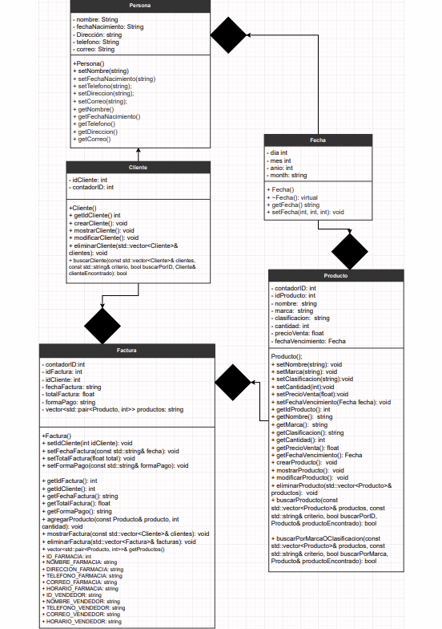

# Sistema de Ventas en C++ con Programación Orientada a Objetos

## Descripción

Este proyecto es un sistema de ventas desarrollado en C++ utilizando principios de Programación Orientada a Objetos (POO). La aplicación se ejecuta en consola y permite gestionar de manera eficiente clientes, productos, vendedores y facturas en un negocio ficticio. El sistema garantiza la organización y control de ventas mediante operaciones CRUD (Crear, Leer, Actualizar, Eliminar) para cada entidad, implementando abstracción, polimorfismo, herencia y composición para un código modular y mantenible.

## Características Principales

### Gestión de Entidades
- **Clientes**: Registro y administración de información de clientes (ID, nombre, teléfono, dirección, correo).
- **Productos**: Control de inventario con detalles como ID, nombre, marca, clasificación, cantidad, precio de venta y compra, fecha de vencimiento y estado.
- **Vendedores**: Administración de vendedores con ID, nombre, teléfono, dirección y correo.
- **Facturas**: Generación automática de facturas detalladas al realizar ventas.

### Funcionalidades CRUD
- Crear, leer, actualizar y eliminar registros para clientes, productos y vendedores.
- Búsqueda avanzada por ID, nombre, marca o clasificación.

### Generación de Facturas
- Facturas detalladas en archivos .txt y .csv.
- Incluye nombre de empresa ficticia, fecha, número de factura, datos del cliente, detalles de productos vendidos y total.
- Actualización automática del inventario al descontar unidades vendidas.

### Reportes e Informes
- Reportes de productos agotados y baja rotación.
- Informes de ventas por rango de fechas, cliente, vendedor.
- Exportación de informes a archivos de texto.

### Persistencia de Datos
- Almacenamiento en archivos .csv y .txt para consulta y actualización persistente.

## Arquitectura del Sistema

### Diagrama UML de Clases



El diagrama muestra la estructura de clases del sistema, incluyendo la clase base abstracta `Entidad` y las clases derivadas `Cliente`, `Producto`, `Vendedor` y `Factura`. Se implementan relaciones de herencia, composición y polimorfismo.

### Tecnologías Utilizadas
- **Lenguaje**: C++
- **Paradigma**: Programación Orientada a Objetos (POO)
- **Persistencia**: Archivos de texto (.txt, .csv)
- **Compilación**: Compatible con Code::Blocks y otros IDEs de C++

## Instalación

1. Clona el repositorio:
   ```bash
   git clone https://github.com/lozadandres/Sistema-de-ventas.git
   ```

2. Navega al directorio del proyecto:
   ```bash
   cd Sistema-de-ventas
   ```

3. Compila el proyecto usando Code::Blocks o un compilador de C++:
   - Abre el archivo `prueba.cbp` en Code::Blocks.
   - Compila y ejecuta el proyecto.

### Requisitos
- Compilador de C++ (ej. g++, MinGW)
- Sistema operativo: Windows (compatible con comandos del sistema)

## Uso

1. Ejecuta la aplicación compilada.
2. Selecciona opciones del menú principal:
   - Gestionar Vendedores
   - Gestionar Clientes
   - Gestionar Productos
   - Gestionar Ventas
3. Realiza operaciones CRUD según sea necesario.
4. Las facturas y reportes se generan automáticamente en archivos de texto.

### Ejemplo de Uso
- Crear un cliente: Selecciona "Gestionar Clientes" > "Crear Cliente" e ingresa los datos.
- Realizar una venta: Selecciona "Gestionar Ventas" > "Realizar una venta", elige cliente, vendedor y productos.

## Contribuidores

- **Andrés Lozada** - Desarrollador principal

## Licencia

Este proyecto está bajo la Licencia MIT. Consulta el archivo LICENSE para más detalles.
